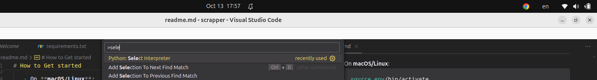
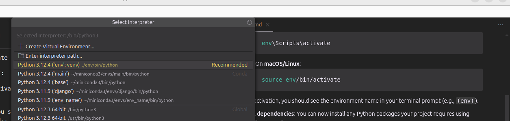

# How to Get started

1. **Open a terminal or command prompt**.

2. **Navigate to your project directory**:

   ```bash
   cd path/to/your/project
   ```

3. **Create the virtual environment**:
   Run the following command to create a virtual environment named `env`:

   ```bash
   python -m venv env
   ```

4. **Activate the virtual environment**:

   - On **Windows**:
     ```bash
     env\Scripts\activate
     ```
   - On **macOS/Linux**:
     ```bash
     source env/bin/activate
     ```

   After activation, you should see the environment name in your terminal prompt (e.g., `(env)`).

5. **Install dependencies**:
   You can now install any Python packages your project requires using `pip`. For example:

   ```bash
   pip install -r requirements.txt
   ```

6. **To make vscode able to resolve the env dependencies follows these steps** :
   Press ctrl+shift+p and type select

   .
   After choosing that option
   
   Choose the env that has a relative path

7. **Deactivate the virtual environment**:
   Once you're done working, you can deactivate the virtual environment by running:

```bash
deactivate
```
